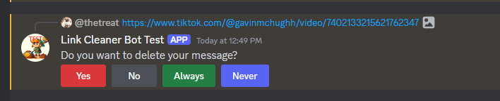

# Link Cleaner Bot

Discord bot which will automatically send a message with a fixed up link for twitter/x/reddit/tiktok with the corresponding embed-friendly link. I'll keep these up to date/switch as needed.

## Top.GG link

https://top.gg/bot/1197601555512316064

## Twitter/X link replacement 

vxtwitter.com - https://github.com/dylanpdx/BetterTwitFix
fixvx.com - https://github.com/dylanpdx/BetterTwitFix

## Reddit link replacement

vxreddit.com - https://github.com/dylanpdx/vxReddit

## Tiktok link replacement

tnktok.com - https://github.com/okdargy/fxtiktok

Run on linux in the background
node /home/<user>/linkcleanerbot/index.js &

Debug on command line
nodemon --inspect index.js

## Invite Bot URL or debugging. Put client ID in for 

* Prod - https://discord.com/api/oauth2/authorize?client_id=1197601555512316064&permissions=0&scope=bot%20applications.commands
* Test - https://discord.com/api/oauth2/authorize?client_id=1197604264881705140&permissions=0&scope=bot%20applications.commands

## Running on linux server

# Enable the service on boot

systemctl enable linkcleanerbot.service

# Start the service

# Run an update 

cd /home/triebe/azarbot/
git pull
cd cd /home/triebe/linkcleanerbot/
systemctl restart linkcleanerbot.service
systemctl restart azarbot.service

systemctl stop linkcleanerbot.service

# Start the service

systemctl start linkcleanerbot.service
systemctl restart linkcleanerbot.service
systemctl status linkcleanerbot.service

# See if service is running

journalctl -u linkcleanerbot.service

# Reload services

systemctl daemon-reload
systemctl restart linkcleanerbot.service
